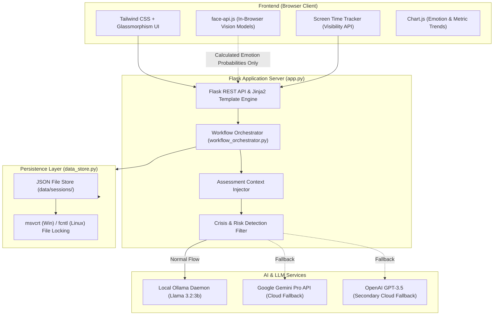

# 🌿 CalmNest – AI-Powered Mental Health & Wellbeing Platform

> **Empowering minds through privacy-first multimodal emotion detection, standardized clinical psychometrics, and context-aware generative AI.**

[](https://python.org)
[](https://flask.palletsprojects.com/)
[](https://ollama.com)
[](https://ai.google.dev/)
[](https://tailwindcss.com/)
[](https://github.com/justadudewhohacks/face-api.js/)
[](https://www.docker.com/)

🔗 **Live Deployment:** [https://velloe-hack.vercel.app/](https://velloe-hack.vercel.app/)

---

## 📌 Table of Contents
- [Problem Statement](#-the-problem-statement)
- [Our Solution](#-the-solution)
- [Key Features](#-key-features)
- [System Architecture](#-system-architecture)
- [Tech Stack](#-technology-stack)
- [Step-by-Step Installation & Setup](#-step-by-step-installation--setup)
- [API Reference](#-api-endpoints-reference)
- [Safety, Ethics & Privacy](#-safety-ethics--privacy-first-design)
- [Future Roadmap](#-future-roadmap)
- [License & Disclaimer](#-medical-disclaimer)

---

## 🚨 The Problem Statement
Mental health issues like anxiety and depression affect over **1 in 7 people globally**, with millions suffering in silence due to:
1. **Pervasive Social Stigma:** Hesitation to visit clinics or seek human therapy in early stages.
2. **Lack of Objective Self-Insight:** Users struggle to identify whether their feelings are transient stress or clinical symptoms.
3. **Generic & Impersonal Chatbots:** Standard bots offer scripted or ungrounded replies without understanding the user's clinical severity or emotional baseline.
4. **Data Privacy Fears:** Users avoid digital apps if their sensitive emotional and psychological data is uploaded to third-party ad networks.

---

## 💡 The Solution: CalmNest
**CalmNest** is an intelligent, compassionate, and privacy-first digital mental wellness companion that unifies:
* **Evidence-Based Clinical Psychometrics** (PHQ-9 for Depression, GAD-7 for Anxiety).
* **Client-Side Edge Computer Vision** for real-time facial expression analysis (runs 100% in-browser with zero video stream upload).
* **Lifestyle Behavioral Telemetry** (sleep patterns, nutrition, physical activity, stressors).
* **Context-Injected Empathetic AI ("Jaya")** powered by local **Llama 3.2** (via Ollama) and **Google Gemini**, equipped with proactive crisis detection.

```
       Clinical Assessments (PHQ-9 + GAD-7)
                      +
       Edge AI Facial Emotion Tracking
                      +
       Holistic Lifestyle & Behavioral Profiling
                      ↓
  ┌──────────────────────────────────────────────┐
  │     CalmNest Holistic Health Synthesis       │
  └──────────────────────────────────────────────┘
                      ↓
  Empathetic AI Companion ("Jaya") + Instant Crisis Net
```

---

## ✨ Key Features

### 1. 🔄 Guided 5-Step Complete Analysis Workflow
A structured clinical and behavioral evaluation pipeline:
* **Step 1: GAD-7 (Generalized Anxiety Disorder-7):** Standard 7-item clinical diagnostic questionnaire for anxiety severity.
* **Step 2: PHQ-9 (Patient Health Questionnaire-9):** Clinical screening questionnaire for depressive disorders and self-harm detection.
* **Step 3: Real-Time Facial Emotion Detection:** Optional camera-assisted emotion recognition capturing affect (Happy, Sad, Neutral, Angry, Fearful).
* **Step 4: Holistic Lifestyle Questionnaire:** Evaluates daily habits, sleep hygiene, nutrition, meditation, and personal happiness triggers.
* **Step 5: Synthesized Clinical Report:** Color-coded severity indicators, radar analysis, with instant 1-click **"Clear Analysis"** for complete data privacy.

### 2. 🤖 Context-Aware AI Companion ("Jaya")
* Unlike traditional bots, **Jaya** receives the user's full assessment profile (anxiety level, depression score, predominant facial affect, and lifestyle routine).
* Provides empathetic, non-judgmental, culturally nuanced Hindi/Hinglish/English support.
* Offline-first capability using local **Llama 3.2 (3B)** via Ollama, with automated fallback to Google Gemini or OpenAI.

### 3. 🚨 Real-Time Crisis Detection & Safety Protocol
* Automatically flags critical PHQ-9 scores (>20) or self-harm keywords.
* Instantly overlays emergency intervention helplines:
  * **Tele-MANAS:** `14416` / `1800-891-4416` (Government of India 24/7 National Mental Health Line)
  * **KIRAN Helpline:** `1800-599-0019` (Govt. of India Social Justice Helpline)
  * **AASRA:** `9820466726` (24/7 Suicide Prevention Helpline)
  * **Vandrevala Foundation:** `1860-2662-345`

### 4. 👁️ Zero-Knowledge Edge Emotion Recognition
* Leverages **face-api.js** running on client WebAssembly / WebGL.
* All facial detection and landmark extraction happen exclusively inside the user's browser.
* **No camera frames or video data are ever sent over the network**, guaranteeing 100% user privacy.

### 5. 🫁 Interactive Guided Breathing (4-7-8 Pranayama)
* Visual bio-feedback pacing circle with smooth CSS transitions.
* Helps down-regulate sympathetic nervous system activity during acute panic or stress episodes.

### 6. ⏱️ Active Screen-Time & Digital Wellbeing Tracker
* In-app telemetry utilizing the browser's **Page Visibility API** and window focus listeners.
* Logs active engagement without recording keystrokes or private browsing data.

---

## 🏛️ System Architecture



---

## 💻 Technology Stack

| Layer | Technologies | Purpose |
| :--- | :--- | :--- |
| **Backend** | Python 3.11, Flask 3.0.0 | REST APIs, routing, session lifecycle, and template rendering |
| **Frontend** | HTML5, Jinja2, Tailwind CSS, Lucide Icons | Responsive glassmorphism interface, intuitive clinical forms |
| **Computer Vision** | `face-api.js` (TensorFlow.js), OpenCV (Python) | Real-time browser-based face expression and emotion classification |
| **AI / LLMs** | Ollama (`llama3.2:3b`), Google Generative AI (`gemini-pro`) | Empathetic mental health dialogue and personalized coping strategies |
| **Data Visualization**| Chart.js | Real-time emotional state radar and screen-time trends |
| **Data Persistence** | Native JSON Store with Cross-Platform File Locking | Safe, race-condition-free local storage without SQL database overhead |
| **Containerization** | Docker, Dockerfile | Unified container running Python application and Ollama server |
| **Deployment** | Vercel (Frontend), Render / Railway / VPS | Multi-cloud deployment options |

---

## 🚀 Step-by-Step Installation & Setup

### Prerequisites
* **Python:** 3.10 or 3.11 installed
* **Git:** Installed
* *(Optional)* **Ollama:** Installed from [ollama.com](https://ollama.com) if running local AI models

### 1. Clone the Repository
```bash
git clone https://github.com/your-username/calm-next.git
cd calm-next
```

### 2. Set Up Virtual Environment
* **On Windows (PowerShell):**
  ```powershell
  python -m venv .venv
  .venv\Scripts\Activate.ps1
  ```
* **On macOS / Linux:**
  ```bash
  python3 -m venv .venv
  source .venv/bin/activate
  ```

### 3. Install Dependencies
```bash
pip install -r requirements.txt
```

### 4. Configure Environment Variables (Optional)
Create a `.env` file in the root directory for cloud AI APIs (if not using local Ollama):
```env
SECRET_KEY=your-super-secret-flask-key
GOOGLE_API_KEY=your_gemini_api_key_here
OPENAI_API_KEY=your_openai_api_key_here
```
*(Note: If no API keys are provided, CalmNest automatically uses local Ollama or rule-based intelligent support).*

### 5. Start Local Ollama Model (For Offline Chatbot)
In a separate terminal:
```bash
ollama serve
ollama pull llama3.2:3b
```

### 6. Run the Application
```bash
python app.py
```

Open your browser and navigate to:
👉 **`http://127.0.0.1:5000`**

---

## 📡 API Endpoints Reference

| Endpoint | Method | Description |
| :--- | :--- | :--- |
| `/` | `GET` | Landing page and application overview |
| `/dashboard` | `GET` | User analytics, assessment history, and screen time metrics |
| `/complete-analysis/start` | `GET` | Initializes new or resumes existing 5-step analysis session |
| `/complete-analysis/gad7/submit` | `POST` | Processes and scores GAD-7 anxiety responses |
| `/complete-analysis/phq9/submit` | `POST` | Scores PHQ-9 depression responses & triggers crisis alerts if severe |
| `/complete-analysis/emotion/submit` | `POST` | Stores in-browser emotion detection summary |
| `/complete-analysis/lifestyle/submit`| `POST` | Saves holistic lifestyle parameters |
| `/complete-analysis/report` | `GET` | Renders synthesized multi-modal health report |
| `/complete-analysis/clear/<id>` | `POST` | Permanently deletes analysis session & resets active state |
| `/chat` / `/chat-stream` | `POST` | Real-time chat with the AI Companion (Ollama / Gemini) |
| `/chatbot/with-context/<id>` | `GET` | Launches contextualized chatbot session pre-fed with test results |
| `/api/screen-time/update` | `POST` | Syncs active tab focus and session duration |

---

## 🛡️ Safety, Ethics & Privacy-First Design

1. **Client-Side Vision Processing:** Webcams are never streamed to a backend server. Landmark detection and affect classification run 100% on-device inside WebGL.
2. **User Data Ownership:** Users can clear their session and history with a single click via the **Clear Analysis** button.
3. **Clinical Boundaries:** CalmNest strictly disclaims medical diagnosing. It acts as an affective companion and screening tool, not a doctor.
4. **Emergency Escalation:** Severe scores or crisis indicators trigger hard-coded, zero-latency emergency helpline modals.

---

## 🗺️ Future Roadmap
- [ ] **Wearable Integration:** Syncing real-time Heart Rate Variability (HRV) from smartwatches for physiological stress detection.
- [ ] **Voice Emotion Recognition:** Multi-lingual voice analysis to detect prosodic pitch and speech cadence markers of fatigue.
- [ ] **Clinical Tele-Health Hand-off:** One-click encrypted report export to verified clinical psychologists.
- [ ] **Multilingual Audio Companion:** Full speech-to-speech interaction in 10+ regional Indian languages.

---

## ⚠️ Medical Disclaimer
*CalmNest is an informational and supportive wellbeing tool designed for psychological self-awareness and stress management. It does not provide medical diagnoses, treatment, or psychiatric prescriptions. If you or someone you know is in acute distress or experiencing thoughts of self-harm, please reach out immediately to national crisis numbers like **Tele-MANAS (14416)**, **AASRA (+91-9820466726)**, or your nearest emergency medical center.*

---

<p align="center">
  <b>Built with ❤️ for mental health awareness, empathy, and accessible care.</b>
</p>
